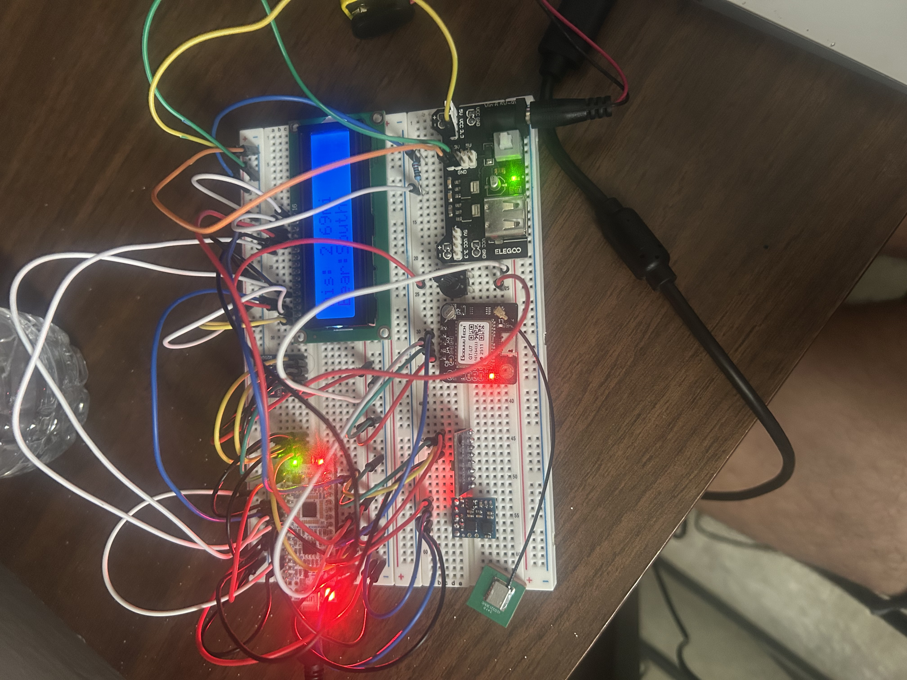

# Liquor Store Compass
## By Luis Abraham and Amy Alvarez

### About

This is a memory-constrained embedded device that will serve as a compass that will point the user to the nearest liquor store... ENJOY YOUR JOURNEY PIRATE!!!

The way this works is we have packed every liquor store coordinate in Florida into a KD-tree and put into a SPI flash. Then we will use that, the magnetometer, and the GPS module to find the nearest store and its relation to the user's current orientation. Then we display to an LCD. Also set up DMA to handle GPS serial signals.

NOTE: Since I started the project less than a week before it was due, the code here is super crammed and rushed, plus I couldn't finish up getting some drivers working (like the LCD). Also I didnt have time to truly try to combine the magnetometer accelero and gyro data to get consistent north heading so the project just tells you the distance and the orientation in relations to north. Still this was fun and got quite a bit done and learned. 

### Components

Core processing: `STM32L412KB`

I2C Components: `GY-271M Magnetometer`

SPI Components: `W25W64 SPI Flash Memory`, `ST7796S LCD Screen`

UART Components: `NEO-6M GPS Satellite Positioning Module`

